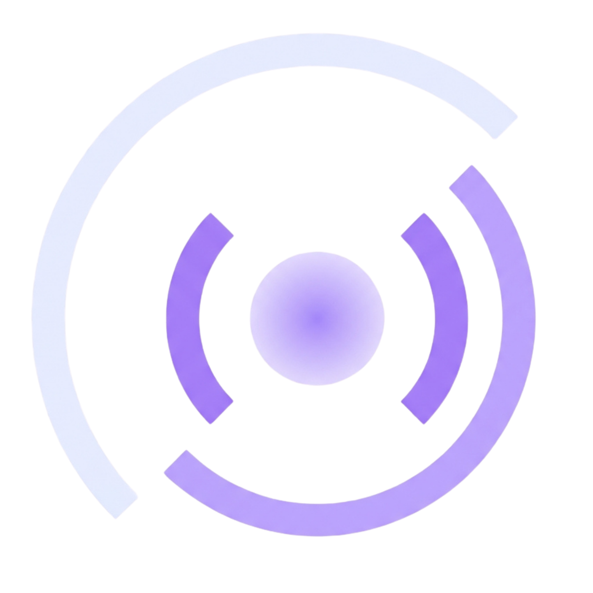
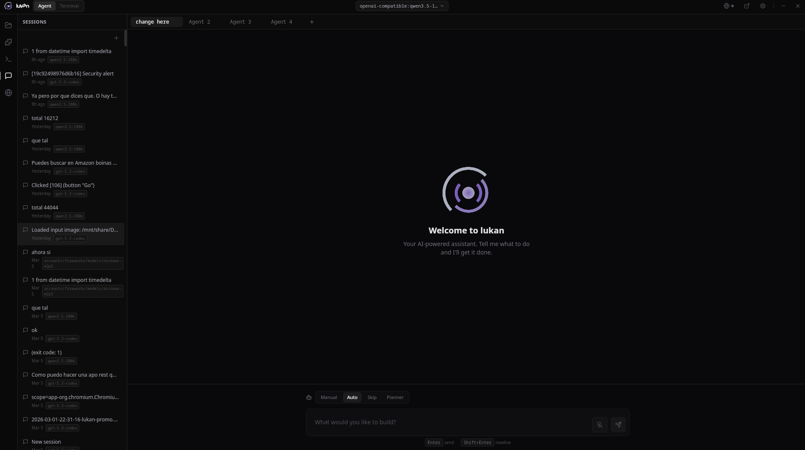
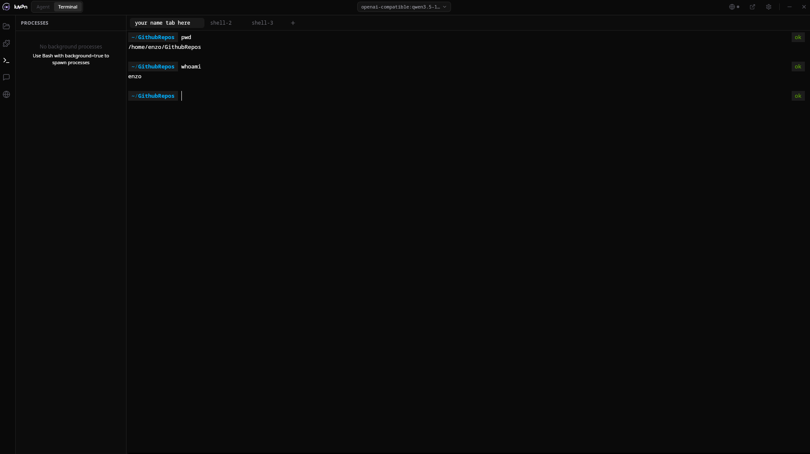
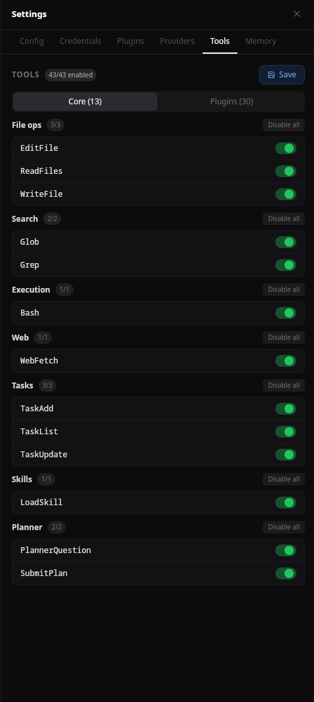
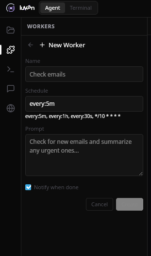
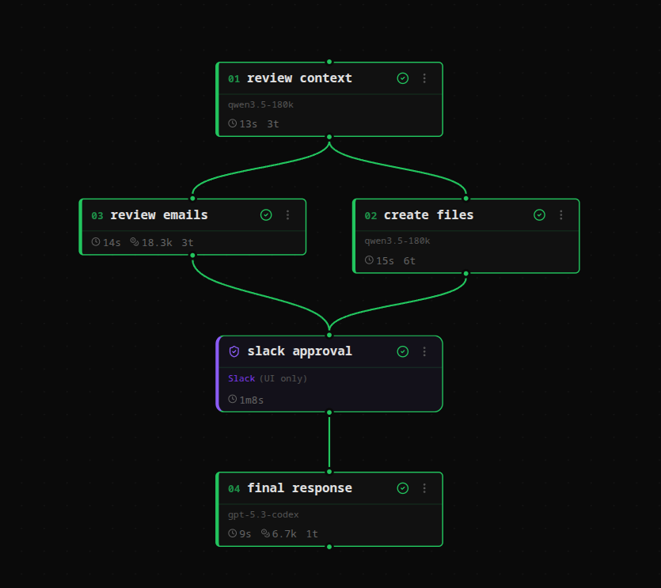
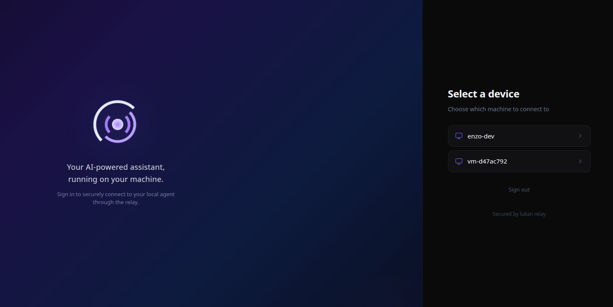
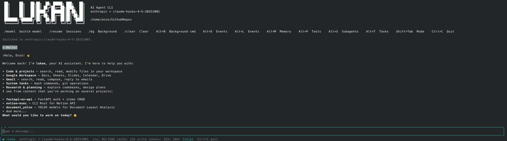

<p align="center">
  
</p>

<p align="center">
  
</p>

<p align="center"><strong>The AI-native agentic workstation. Your desktop, amplified.</strong></p>

<p align="center">
  <a href="https://github.com/lukanlabs/lukan/blob/master/LICENSE"></a>
  <a href="https://github.com/lukanlabs/lukan/releases"></a>
  
  
</p>

<p align="center">
Lukan is an AI agent that turns your terminal, browser, and messaging into one intelligent workspace.<br>
Multi-provider, multi-interface, E2E encrypted remote access, background workers, and sandboxed execution.<br>
Built in Rust. Single binary. No runtime dependencies.
</p>

<p align="center">
  
</p>

## Features

- **10 LLM Providers** — Anthropic, OpenAI Codex, GitHub Copilot, Fireworks, Nebius, Ollama Cloud, Zai, Gemini, Lukan Cloud, and any OpenAI-compatible endpoint (vLLM, Ollama, LM Studio)
- **Multiple Interfaces** — Terminal UI (ratatui), Web UI, Desktop app (Tauri), and CLI
- **Browser Automation** — Full Chrome DevTools Protocol: navigate, screenshot, click, type, evaluate JS, export PDF
- **Plugin System** — WhatsApp, Telegram, Slack, Email, Gmail, Google Workspace (Sheets, Docs, Calendar, Drive), Docker Monitor, and more
- **Sandboxed Execution** — OS-level isolation (bwrap), granular permission modes (Planner/Auto/Manual), sensitive file detection
- **E2E Encrypted Relay** — Access your workstation remotely with X25519 + AES-GCM encryption
- **Background Workers** — Scheduled autonomous tasks with cron-style execution
- **Persistent Memory** — Context compaction, session management, and long-term memory across conversations
- **Skills** — Markdown-based instruction system for project-specific workflows, compatible with community skill formats
- **Pipelines** — DAG-based multi-agent workflows with visual editor, parallel execution, and human-in-the-loop approval gates
- **Single Binary** — No runtime dependencies, instant startup

<details>
<summary><strong>Screenshots</strong></summary>
<br>

| Sessions & Agent Tabs | Model Selector |
|:---:|:---:|
|  |  |

| Embedded Terminal |
|:---:|
|  |

| Settings & Tools | Workers |
|:---:|:---:|
|  |  |

| Pipelines & Approval Gates |
|:---:|
|  |

| Remote Access (Relay) | Terminal TUI |
|:---:|:---:|
|  |  |

</details>

## What Lukan Can Do

| Capability | Details |
|------------|---------|
| **LLM Providers** | Multi-provider — Anthropic, OpenAI, GitHub Copilot, Fireworks, Gemini, Ollama, and any OpenAI-compatible endpoint |
| **Interfaces** | Terminal UI (ratatui), Web UI, Desktop app (Tauri), CLI |
| **Embedded Terminal** | tmux-backed sessions in Web & Desktop UI — sessions persist across reconnects with scrollback recovery. Falls back to PTY when tmux is not installed |
| **Browser Automation** | CDP native with 10 tools: navigate, screenshot, click, type, evaluate JS, export PDF, tab management |
| **Messaging Channels** | WhatsApp, Telegram, Slack, Discord, Email, Gmail via plugin system |
| **Google Workspace** | Sheets, Docs, Calendar, Slides, Drive via plugins & skills |
| **Plugin System** | Built-in registry, hot-reload, IPC protocol |
| **Pipelines** | DAG-based multi-agent workflows with visual editor, parallel execution, and human-in-the-loop approval gates |
| **Background Workers** | Cron scheduler + daemon for autonomous scheduled tasks |
| **Sub-agents** | Parallel sub-agent execution for complex multi-step tasks |
| **Skills** | Markdown-based instruction system for project-specific workflows |
| **Long-term Memory** | MEMORY.md + context compaction + session checkpoints & rewind |
| **E2E Encrypted Relay** | Remote access via X25519 key exchange + AES-GCM authenticated encryption |
| **OS-level Sandbox** | bubblewrap (bwrap) isolation with configurable allowed paths |
| **Permission Modes** | Planner (human reviews all), Auto (whitelisted tools run freely), Manual (approve each call) |
| **Sensitive File Detection** | Pattern-based blocking for .env, .ssh/, .aws/, credentials, and private keys |
| **Audio Input** | Desktop + Web UI via Whisper plugin (local transcription, GPU/CPU auto-detect) |
| **Single Binary** | Rust, no runtime dependencies, instant startup |
| **License** | MIT — Free, bring your own keys |

## Install

```bash
# CLI only (single binary — includes TUI + Web UI)
curl -fsSL https://get.lukan.ai/install.sh | bash

# CLI + Desktop app (Tauri)
curl -fsSL https://get.lukan.ai/install.sh | bash -s -- --desktop
```

Or build from source:

```bash
git clone https://github.com/lukanlabs/lukan.git
cd lukan
cargo build --release
```

### Docker

```bash
# Build the image
docker build -t lukan .

# Run with API key
docker run -d -p 3000:3000 -e ANTHROPIC_API_KEY=sk-... lukan

# Run with persistent config
docker run -d -p 3000:3000 -v ~/.config/lukan:/home/lukan/.config/lukan lukan

# Interactive setup inside the container
docker exec -it <container> bash
lukan setup
lukan   # start TUI
```

The web UI is accessible at `http://localhost:3000`.

## Uninstall

**curl install:**
```bash
rm ~/.local/bin/lukan ~/.local/bin/lukan-desktop ~/.local/bin/lukan-relay
```

**AppImage:**
```bash
rm Lukan_Desktop.AppImage
rm ~/.local/bin/lukan
```

**deb package:**
```bash
sudo dpkg -r lukan-desktop
rm ~/.local/bin/lukan
```

**Config & data** (optional, shared across all install methods):
```bash
rm -rf ~/.config/lukan ~/.local/share/lukan
```

## Quick Start

```bash
# First time: configure your provider and API keys
lukan setup

# Start chatting (TUI mode)
lukan chat

# Continue your last session
lukan chat -c
```

### Choose your interface

```bash
# Terminal UI (default)
lukan chat

# Web UI — opens in your browser
lukan chat --ui web

# Desktop app — native Tauri window with terminal, browser panel, and plugins
lukan chat --desktop
```

### Choose your provider

```bash
# Use a specific provider
lukan chat --provider anthropic
lukan chat --provider github-copilot
lukan chat --provider openai-compatible

# Use a specific model
lukan chat --provider fireworks --model accounts/fireworks/models/llama-v3p3-70b-instruct
```

### Browser automation

```bash
# Auto-detect and launch a browser
lukan chat --browser

# Use a specific browser
lukan chat --browser chrome
lukan chat --browser edge

# Connect to an already running browser
lukan chat --browser-cdp http://localhost:9222

# Run browser in visible mode (see what the agent does)
lukan chat --browser-visible

# Keep browser profile across sessions
lukan chat --browser --browser-profile persistent
```

### Remote access

```bash
# Log in to your relay (access lukan from any browser)
lukan login

# Check relay connection
lukan relay status
```

### Diagnostics

```bash
# Show current config, provider, model, and system info
lukan doctor

# List available models for a provider
lukan models anthropic

# Self-update
lukan update
```

### Embedded terminal

The Web and Desktop UIs include a full terminal emulator powered by xterm.js. When tmux is available, sessions are backed by tmux — they persist across page reloads, browser crashes, and reconnects, with full scrollback recovery. Without tmux, terminals fall back to direct PTY.

- Full terminal — run any CLI tool, including other agents (Claude Code, Codex CLI, OpenCode, etc.)
- Multiple terminal tabs with rename support
- Sessions panel in the sidebar to manage and switch between terminals
- Send running processes to background mid-execution
- File explorer with inline preview

### Agent tabs & sessions

Run multiple agents in parallel, each with its own context and conversation history. Sessions are saved automatically and can be loaded, rewound, or continued later.

- Multiple agent tabs — work on different tasks simultaneously
- Session checkpoints — rewind to any point in the conversation (CLI)
- Session recovery — resume after disconnects or crashes
- Background processes — long-running commands can be sent to background while the agent continues working

### Audio input

Record audio directly in the Web and Desktop UI. Transcription runs locally via the Whisper plugin using whisper.cpp with GPU/CPU auto-detection — no data leaves your machine.

```bash
# Install the whisper plugin
lukan plugin install whisper
```

## Remote Access (Relay)

Lukan includes a built-in relay system for accessing your workstation from any browser, anywhere. The connection is end-to-end encrypted — the relay server never sees your data.

```
┌──────────────┐        ┌──────────────┐        ┌──────────────┐
│   Browser    │◄──────►│  Relay Server│◄──────►│  Your Machine│
│  (any device)│  E2E   │  (cloud)     │  E2E   │  (lukan)     │
└──────────────┘  enc.  └──────────────┘  enc.  └──────────────┘
```

- **E2E Encryption** — X25519 key exchange + AES-256-GCM. The relay only forwards opaque ciphertext.
- **Google OAuth** — Login with your Google account, no extra credentials to manage.
- **Full Web UI** — Same interface as local `--ui web`, including agent, terminals, file explorer, and plugins.
- **No port forwarding** — Works behind NAT, firewalls, and corporate networks.

```bash
# Authenticate with the relay
lukan login

# Check connection status
lukan relay status

# Your workstation is now accessible at your relay URL
```

## Architecture

Lukan is a Cargo workspace with 11 crates (~49K lines of Rust) + a React frontend (~6K lines of TypeScript):

```
lukan                  CLI entry point and subcommands
lukan-core             Shared types, config, errors, crypto primitives
lukan-providers        LLM provider implementations (8 providers)
lukan-tools            Tool system: Bash, ReadFile, WriteFile, EditFile, Glob, Grep, WebFetch, Browser, Tasks
lukan-agent            Agent loop, sessions, memory, permission system, sub-agents
lukan-tui              Terminal UI (ratatui) with markdown rendering and syntax highlighting
lukan-web              Axum web server with WebSocket streaming and embedded React UI
lukan-desktop          Tauri desktop app with PTY, audio recording, and native integration
lukan-browser          Chrome DevTools Protocol client
lukan-plugins          Plugin discovery, lifecycle, and IPC protocol
lukan-search           Symbol indexing (tree-sitter) — in development
lukan-relay            Relay server for E2E encrypted remote access
desktop-client/        React + TypeScript frontend (shared across Web, Desktop, and Relay modes)
```

See [ARCHITECTURE.md](ARCHITECTURE.md) for details.

## Providers

| Provider | Setup |
|----------|-------|
| Anthropic | `lukan setup` or set `ANTHROPIC_API_KEY` |
| OpenAI Codex | `lukan codex-auth` (OAuth) |
| GitHub Copilot | `lukan copilot-auth` (OAuth Device Flow) |
| Fireworks | API key via `lukan setup` |
| Nebius | API key via `lukan setup` |
| Ollama Cloud | API key via `lukan setup` |
| Zai | API key via `lukan setup` |
| Gemini | API key via `lukan setup` |
| Lukan Cloud | Coming soon |
| OpenAI-compatible | Base URL + API key via `lukan setup` (works with vLLM, Ollama, LM Studio) |

## Plugins

Plugins extend lukan with messaging channels and external tools:

```bash
# Browse and install from the registry
lukan plugin install

# Install by name
lukan plugin install whatsapp

# Configure credentials
lukan skill env whatsapp set BRIDGE_URL ws://localhost:3001

# Start a channel plugin
lukan plugin start whatsapp

# Check status
lukan plugin status whatsapp

# View logs
lukan plugin logs whatsapp
```

### Available plugins

| Plugin | Type | What it does |
|--------|------|-------------|
| **WhatsApp** | Channel | Chat with lukan from WhatsApp (QR auth, groups, audio transcription) |
| **Email** | Channel | Receive and reply to emails (IMAP/SMTP) |
| **Gmail** | Tools | Search, read, send, and manage Gmail |
| **Google Workspace** | Tools | Sheets, Docs, Calendar, Slides, Drive operations |
| **Docker Monitor** | Channel | Monitor container events and health |
| **Security Monitor** | Channel | Track security-related system events |
| **Whisper** | Channel | Local audio transcription via whisper.cpp |
| **Telegram** | Channel | Chat with lukan from Telegram (Bot API, groups, user allowlist) |
| **Slack** | Channel | Chat with lukan from Slack (Socket Mode, threads, channel allowlist) |
| **Discord** | Channel | Chat with lukan from Discord (Gateway API, threads, voice transcription) |
| **Nano Banana Pro** | Tools | Image generation via Gemini |

## Skills

Skills are markdown instruction files that customize agent behavior per-project:

```bash
# List discovered skills
lukan skill list

# Skills live in .lukan/skills/<name>/SKILL.md
mkdir -p .lukan/skills/deploy
cat > .lukan/skills/deploy/SKILL.md << 'EOF'
---
name: Deploy
description: Deployment workflow for this project
---
# Deploy
1. Run tests first
2. Build with `make release`
3. Deploy to staging before production
EOF
```

## Workers

Schedule autonomous background tasks that run on their own:

```bash
# Create a worker interactively (set prompt, schedule, tools)
lukan worker add

# List all workers
lukan worker list

# Browse run history and view output
lukan worker runs

# Pause/resume a worker
lukan worker pause
lukan worker resume

# Start the background daemon (runs scheduled workers)
lukan daemon start

# Check daemon status
lukan daemon status
```

## Security

Lukan takes security seriously:

- **Permission Modes**: Planner (human reviews all actions), Auto (whitelisted tools run freely), Manual (approve each call)
- **Sandbox**: OS-level isolation via bubblewrap (bwrap) with configurable allowed paths
- **Sensitive File Detection**: Blocks access to `.env`, `.ssh/`, `.aws/`, credentials, and private keys by pattern
- **E2E Encryption**: Relay connections use X25519 key exchange + AES-GCM authenticated encryption
- **Plugin Isolation**: Plugins run as separate processes with declared permissions and IPC protocol

## Configuration

Config lives in `~/.config/lukan/`:

```
~/.config/lukan/
  config.json        Main configuration (provider, model, permissions)
  credentials.json   API keys and tokens (never committed)
  sessions/          Chat history
  plugins/           Installed plugins
  MEMORY.md          Persistent agent memory
```

## Commands

| Command | Description |
|---------|-------------|
| `lukan chat` | Start interactive chat (TUI, Web, or Desktop) |
| `lukan setup` | Interactive setup wizard (provider, model, API keys) |
| `lukan doctor` | Show configuration, provider, model, and system diagnostics |
| `lukan models [provider]` | List and select models for a provider |
| `lukan plugin install` | Install plugins from the registry |
| `lukan plugin start <name>` | Start a channel plugin |
| `lukan plugin status <name>` | Show plugin status and config |
| `lukan plugin logs <name>` | View plugin logs |
| `lukan skill list` | List discovered skills |
| `lukan skill env <name>` | Manage skill environment variables |
| `lukan worker add` | Create a scheduled worker interactively |
| `lukan worker list` | List all workers |
| `lukan worker runs` | Browse run history and view output |
| `lukan daemon start` | Start the background worker scheduler |
| `lukan daemon status` | Check if the daemon is running |
| `lukan sandbox enable` | Enable OS-level sandboxing (bwrap) |
| `lukan update` | Self-update to the latest version |
| `lukan login` | Authenticate with relay server (Google OAuth) |
| `lukan relay status` | Show relay connection status |
| `lukan codex-auth` | Authenticate with OpenAI Codex (OAuth) |
| `lukan copilot-auth` | Authenticate with GitHub Copilot (OAuth Device Flow) |

## Development

```bash
# Build all crates
cargo build

# Run quality checks
cargo fmt && cargo clippy -- -D warnings && cargo test

# Build desktop app (requires bun)
cd desktop-client && bun run build

# Run the TUI in dev mode
cargo run -- chat
```

## Contributing

See [CONTRIBUTING.md](CONTRIBUTING.md) for guidelines.

## License

This project is licensed under the [MIT License](LICENSE).
